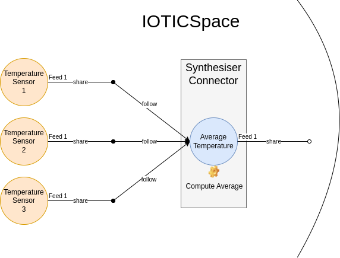

# IOTICS Examples

This folder contains advanced and complete applications implemented with REST (`*_rest.py`), STOMP (`*_stomp.py`) and the gRPC Python Client Library (`*_grpc.py`).

## Publisher Connector

It creates a Twin Model of a Temperature Sensor along with 3 Temperature Sensor Twins based on the aforementioned Model. The Temperature Sensor Twins in turn generate and share via a Feed a random temperature between 10C and 30C.

It can be executed in combination with:

-   Synthesiser Connector

__Features__

-   Use of the High Level Identity Library;
-   Use of the REST approach (`publisher_connector_rest.py`);
-   Use of the gRPC Python Client Library (`publisher_connector_grpc.py`);
-   Twin Model & Twins from Model;
-   Publisher Twins;
-   Selective Data and Metadata sharing;
-   Use of IOTICS Special Properties, including *Host Metadata Allow List*, *Host Allow List*, *Type*, *Model*, *Label*, *Comment*, *Space Name*, *Colour*, *Created By*;
-   Use of external Ontologies: *saref.etsi.org*, *qudt.org*;
-   Auth Token refreshed automatically before it expires;

## Synthesiser Connector

It creates a Twin with a Feed, then in turn:
1. Search for the Publisher Twins generated by the Publisher Connector above (it will find 4 Twins);
2. Subscribe to their Feeds and wait for new data;
3. When new data is received compute the average;
4. Share the average data via the Feed.

It can be executed in combination with:

-   Publisher Connector

__Features__

-   Use of the High Level Identity Library;
-   Use of the REST+STOMP approach (`synthesiser_connector_rest_stomp.py`)
-   Use of the gRPC Python Client Library (coming soon);
-   Synthesiser Twin (Follower and Publisher);
-   Selective Data and Metadata sharing;
-   Use of IOTICS Special Properties, including *Label* and *Comment*;
-   Use of external Ontologies: *saref.etsi.org*, *qudt.org*;
-   Auth Token refreshed automatically before it expires;

