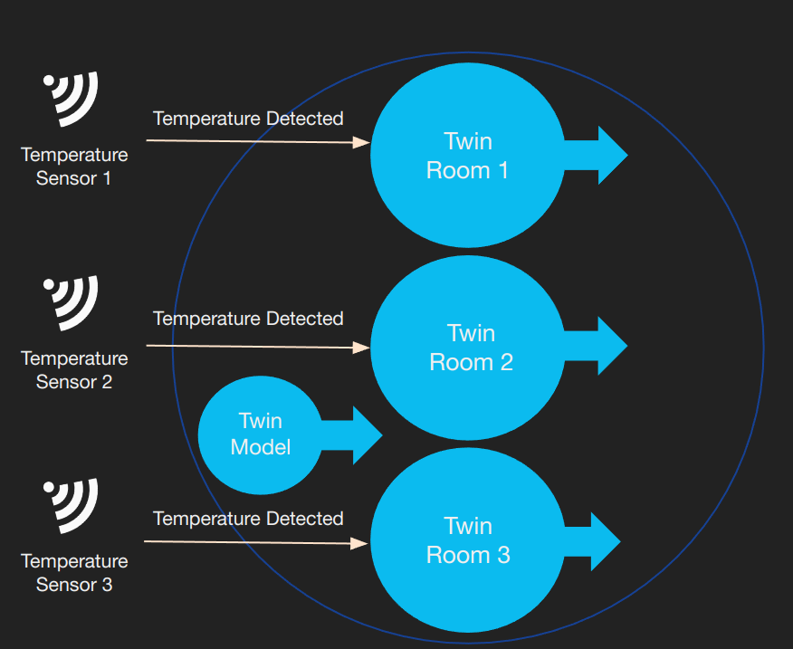

# IOTICS Examples

This folder contains advanced and complete applications implemented with the gRPC Python Client Library.

## Publisher Connector

It creates a Twin Model of a Temperature Sensor along with 3 Temperature Sensor Twins based on the aforementioned Model. The Temperature Sensor Twins in turn generate and share via a Feed a random temperature between 10C and 30C.

It can be executed in combination with:

-   Synthesiser Connector (coming soon)

__Features__

-   Use of the High Level Identity Library;
-   Use of the gRPC Python Client Library;
-   Twin Model & Twins from Model;
-   Publisher Twins;
-   Selective Data and Metadata sharing;
-   Use of IOTICS Special Properties, including *Host Metadata Allow List*, *Host Allow List*, *Type*, *Model*, *Label*, *Comment*, *Space Name*, *Colour*, *Created By*;
-   Use of external Ontologies: *saref.etsi.org*, *qudt.org*;
-   Auth Token refreshed automatically before it expires;

